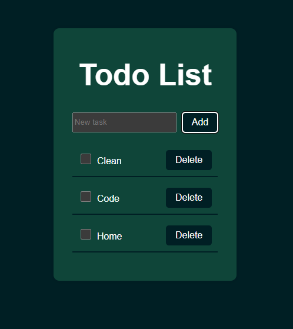

# 📝 To-Do App in React

This is a simple **To-Do List application** built with **React** and **Vite**. It allows users to add tasks, mark them as completed, and delete them.

---

## 🛠 Technologies Used

- React (with Hooks)
- JavaScript
- Vite
- CSS

---

## 🚀 How to Use

1. Clone the repository:

```bash
git clone https://github.com/your-username/todo-react-app.git
cd todo-react-app
```

2. Install dependencies:

```bash
npm install
```

3. Run the development server:

```bash
npm run dev
```

## ✨ Features

- Add new tasks
- Mark tasks as completed
- Delete tasks

## 📸 Screenshot



## 📁 Project Structure

```bash
src/
├── components/
│   ├── TaskForm.jsx
│   └── TaskList.jsx
├── App.jsx
├── App.css
└── main.jsx
```

## 🌐 Live Demo

[Todo List](https://todo-list-ten-amber-52.vercel.app/)

## 👩‍💻 Author

Vivian Loza
[LinkedIn](https://www.linkedin.com/in/vivian-loza777/)
[GitHub](https://github.com/tamikaivi)
